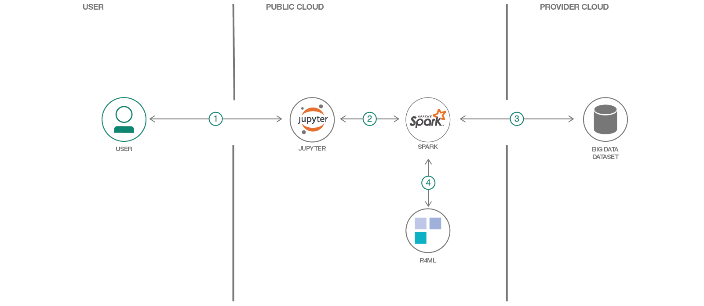
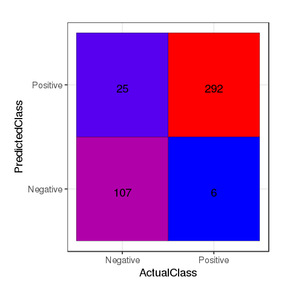
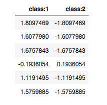
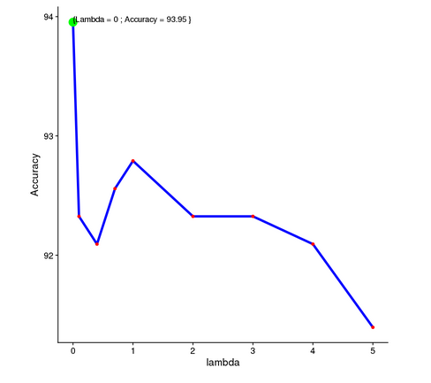

# Predicting flight delay and building an ML pipeline using R4ML

In this Code Pattern we will use R4ML, a scalable R package, running on IBM Watson Studio to perform various Machine Learning exercises. For those users who are unfamiliar with Watson Studio, it is an interactive, collaborative, cloud-based environment where data scientists, developers, and others interested in data science can use tools (e.g., RStudio, Jupyter Notebooks, Spark, etc.) to collaborate, share, and gather insight from their data.

When the reader has completed this Code Pattern, they will understand how to:

* Use [Jupyter Notebooks](http://jupyter.org/) to load, visualize, and analyze data.
* Run Notebooks in [IBM Watson Studio](https://dataplatform.ibm.com).
* Leverage [R4ML](https://github.com/CODAIT/r4ml) to conduct preprocessing and exploratory analysis with big data.

The Intended audience of this code pattern is data scientists, who wish to apply scalable machine learning algorithms using R.

This specific Code Pattern will provide a SVM (Suport Vector Machine) example to demonstrate the ease and power of R4ML in implementing scalable classification.

R4ML provides various out-of-the-box algorithms to experiment with. For those users who are new to R4ML, please visit the [R4ML on Watson Studio](https://github.com/IBM/r4ml-on-watson-studio) Code Pattern for an introduction on how it can be implemented for data preprocessing and data exploration. For more information about additional R4ML functionality, support, documentation, and roadmap, please visit [R4ML](https://github.com/CODAIT/r4ml).

### What problem does it solve for developers?

* Learn Large Scale Model Training for classification using a Support Vector Machine.
* Learn Large Scale Model Tuning using Cross validation.

### Source of data

* We will use the Airline On-Time Statistics and Delay Causes from [RITA](http://www.rita.dot.gov). A 1% sample of the dataset is available from the [American Statistical Association (ASA)](http://stat-computing.org/dataexpo/2009/the-data.html). All of the data is in the public domain.
* For this Code Pattern, we will use a subset of the above dataset, which is shipped with R4ML.
* This Code Pattern can also work with the larger RITA dataset.

## Flow



1. Load the provided notebook onto into IBM Watson Studio.
2. The notebook interacts with an Apache Spark instance.
3. A sample big data dataset is loaded into a Jupyter Notebook.
4. R4ML, running atop Apache Spark, is used to perform machine learning.

Included Components:

* [IBM Watson Studio](https://dataplatform.ibm.com): Analyze data using RStudio, Jupyter, and Python in a configured, collaborative environment that includes IBM value-adds, such as managed Spark.
* [IBM Analytics for Apache Spark](https://console.ng.bluemix.net/catalog/services/apache-spark): An open source cluster computing framework optimized for extremely fast and large scale data processing.

## Featured Technologies:

* [Jupyter Notebooks](http://jupyter.org/): An open source web application that allows you to create and share documents that contain live code, equations, visualizations and explanatory text.
* [R4ML](https://github.com/CODAIT/r4ml): R4ML is a scalable, hybrid approach to ML/Stats using R, Apache SystemML, and Apache Spark

# Steps:

This Code Pattern consists of following activities:

* [Run Jupyter notebooks in the IBM Watson Studio](#run-jupyter-notebooks-in-the-ibm-watson-studio).
* [Explore and Analyze the Data](#explore-and-analyze-the-data).

## Run Jupyter notebooks in the IBM Watson Studio

1. [Sign up for the Watson Studio](#1-sign-up-for-the-watson-studio)
2. [Create a new Watson Studio project](#2-create-a-new-watson-studio-project)
3. [Create the Spark service](#3-create-the-spark-service)
4. [Create the notebook](#4-create-the-notebook)
5. [Run the notebook](#5-run-the-notebook)
6. [Save and Share](#6-save-and-share)

### 1. Sign up for the Watson Studio

Log in or sign up for IBM's [Watson Studio](https://dataplatform.ibm.com).

> Note: if you would prefer to skip the remaining Watson Studio set-up steps and just follow along by viewing the completed Notebook, simply:
> * View the completed [notebook](https://github.com/IBM/predict-flight-delay-using-r4ml/tree/master/notebooks/R4ML_Classification_modeling_using_SVM.ipynb) and its outputs, as is. 
> * While viewing the notebook, you can optionally download it to store for future use.
> * When complete, continue this code pattern by jumping ahead to the [Explore and Analyze the Data](#explore-and-analyze-the-data) section.

### 2. Create a new Watson Studio project

* Select the `New Project` option from the Watson Studio landing page and choose the `Data Science` option.


* To create a project in Watson Studio, give the project a name and either create a new `Cloud Object Storage` service or select an existing one from your IBM Cloud account.


* Upon a successful project creation, you are taken to a dashboard view of your project. Take note of the `Assets` and `Settings` tabs, we'll be using them to associate our project with any external assets (datasets and notebooks) and any IBM cloud services.


## 3. Create the Spark service

* In your project go to the `Settings` tab, scroll down to `Associated Services` and choose `+ Add service` -> `Spark`


* Either choose an `Existing` Spark service, or create a `New` one


## 4. Create the notebook

* From the project dashboard view, click the `Assets` tab, click the `+ New notebook` button.


* Give your notebook a name and select your desired runtime, in this case we'll be using the associated Spark runtime.

> Note: For this Code Pattern, after setting the run-time to your `Spark` instance, set language to `R`


* Now select the `From URL` tab to specify the URL to the notebook in this repository.


* Enter this URL:

```
https://github.com/IBM/predict-flight-delay-using-r4ml/blob/master/notebooks/R4ML_Classification_modeling_using_SVM.ipynb
```

* Click the `Create` button.

## 5. Run the notebook

When a notebook is executed, what is actually happening is that each code cell in
the notebook is executed, in order, from top to bottom.

Each code cell is selectable and is preceded by a tag in the left margin. The tag
format is `In [x]:`. Depending on the state of the notebook, the `x` can be:

* A blank, this indicates that the cell has never been executed.
* A number, this number represents the relative order this code step was executed.
* A `*`, which indicates that the cell is currently executing.

There are several ways to execute the code cells in your notebook:

* One cell at a time.
  * Select the cell, and then press the `Play` button in the toolbar.
* Batch mode, in sequential order.
  * From the `Cell` menu bar, there are several options available. For example, you
    can `Run All` cells in your notebook, or you can `Run All Below`, that will
    start executing from the first cell under the currently selected cell, and then
    continue executing all cells that follow.
* At a scheduled time.
  * Press the `Schedule` button located in the top right section of your notebook
    panel. Here you can schedule your notebook to be executed once at some future
    time, or repeatedly at your specified interval.

## 6. Save and share

### How to save your work:

Under the `File` menu, there are several ways to save your notebook:

* `Save` will simply save the current state of your notebook, without any version
  information.
* `Save Version` will save your current state of your notebook with a version tag
  that contains a date and time stamp. Up to 10 versions of your notebook can be
  saved, each one retrievable by selecting the `Revert To Version` menu item.

### How to share your work:

You can share your notebook by selecting the `Share` button located in the top
right section of your notebook panel. The end result of this action will be a URL
link that will display a “read-only” version of your notebook. You have several
options to specify exactly what you want shared from your notebook:

* `Only text and output`: will remove all code cells from the notebook view.
* `All content excluding sensitive code cells`:  will remove any code cells
  that contain a *sensitive* tag. For example, `# @hidden_cell` is used to protect
  your dashDB credentials from being shared.
* `All content, including code`: displays the notebook as is.
* A variety of `download as` options are also available in the menu.

## Explore and Analyze the Data

The notebook is well documented and will guide you through the exercise. Some of the main tasks that will be covered include:

* Load packages and data and do the initial transformation and various feature engineering.
* Use the built-in SVM algorithm from R4ML to predict whether an airline will be delayed or not.
* Observe the output accuracy and confusion matrix.
* Use Cross Validation to improve the accuracy of the classifications.

You will also see the advantages of using R4ML, which is a git-downloadable open-source R packaged from IBM. Some of these include:

* Created on top of SparkR and Apache SystemML, so it supports features from both.
* Acts as an R bridge between SparkR and Apache SystemML.
* Provides a collection of canned algorithms.
* Provides the ability to create custom ML algorithms.
* Provides both SparkR and Apache SystemML functionality.
* APIs that should be familiar to R users.

## Sample output

The following examples taken from the notebook show how we attempt to determine our how our model will preform in predicting flight delays:

### Confusion Matrix
Here we take a look at a R4ML confusion matrix, where we can see that True Positive and True Negative are very high and that False Positive and False Negative are low. This means we can be more confident of our model than just the accuracy-based analysis.



### Predicted Scores
We can also see the predicted scores. The higher the score, the higher the margin and the better or more confident we are of the prediction.



As you can see, row 1 has better margins than row 2, which means that its prediction confidence level is high. You may have noticed that there is one anomoly - in row 4, both numbers are low which indicates low confidence and that in fact the row was misclassified (since `class:1` has -ve sign and `class:2` has positive sign).

Note that these scores are the most important determinent for selecting our model. 

### Cross Validation

In the end, we adjust our model by using cross-validation. Here we show the results of testing our models against a series of lambda parameter values to find the one that provides the best accuracy.



## Links

* [Watson Studio](https://datascience.ibm.com/docs/content/analyze-data/creating-notebooks.html)
* [Data Set](http://stat-computing.org/dataexpo/2009/the-data.html)
* [R4ML](https://github.com/CODAIT/r4ml)
* [R4ML on Watson Studio Code Pattern](https://github.com/IBM/r4ml-on-watson-studio)

# Learn more

* **Data Analytics Code Patterns**: Enjoyed this Code Pattern? Check out our other [Data Analytics Code Patterns](https://developer.ibm.com/code/technologies/data-science/)
* **AI and Data Code Pattern Playlist**: Bookmark our [playlist](https://www.youtube.com/playlist?list=PLzUbsvIyrNfknNewObx5N7uGZ5FKH0Fde) with all of our Code Pattern videos
* **Watson Studio**: Master the art of data science with IBM's [Watson Studio](https://dataplatform.ibm.com/)
* **Spark on IBM Cloud**: Need a Spark cluster? Create up to 30 Spark executors on IBM Cloud with our [Spark service](https://console.bluemix.net/catalog/services/apache-spark)

# License

[Apache 2.0](LICENSE)
